Hi guys, Welcome to you all

# LinkedIn Clone

Features:-

1. USER AUTHENTICATION AND REGISTRATION :-
   User registration and login with email and password.
   User authentication is handled through JWT (JSON Web Tokens).
   Users can register with their first name, last name, email, password, location, occupation, and profile picture.
   Password hashing for secure storage.

2. POSTING FUNCTIONALITY :-
   Users can create new posts with text and optional images.
   Posts can be edited or deleted by the post creator.
   Users can like and comment on posts.

3. ADD AND REMOVE FRIEND :-
   Users can add or remove friends from their friend list using the "+" and "-" icons respectively.
   The friend list is stored in the application state and is updated after adding or removing friends.

4. NEWS FEED :-
   The home page displays a news feed with posts from different users.

5. RESPONSIVE DESIGN :-
   The application is responsive and works on various devices and screen sizes.

6. DARK MODE :-
   Users can toggle between light and dark mode for the application.

7. ANALYTICS AND INSIGHTS :-
   Basic analytics and insights are provided to users, such as the number of likes, comments, and post views.

8. VIEW USER PROFILES :-
   Users can view their friend list and posts.
   Users can see their own posts, as well as posts from other users on their profile page.
   The profile page is accessible by clicking on a user's name from the friend list or posts.

9. ONE TO ONE CHAT:
   Users can chat to their connections in real time end to end encrypted using socket.io library
   in backend and for frontend socket.io-client libray.

10. ERROR HANDLING AND VALIDATION :-
    Proper error handling and validation are implemented for forms and user input.

11. API ENDPOINTS AND DATA STORAGE :-
    Backend APIs are used for handling user authentication, post-creation, and other functionalities.
    User and post data are stored in a database (e.g., MongoDB) for persistent storage.
12. Job Apply:-
    Users can apply to job created by company and look for their desired jobs.

---

------------Some Picture of Website---------

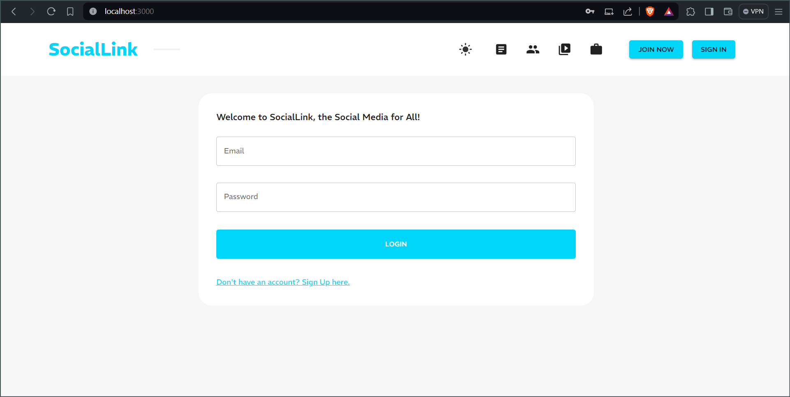
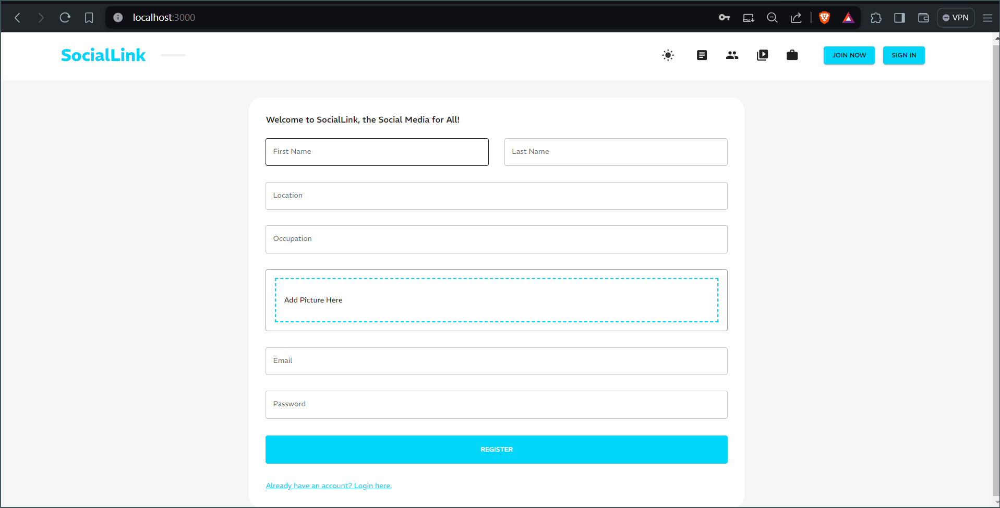

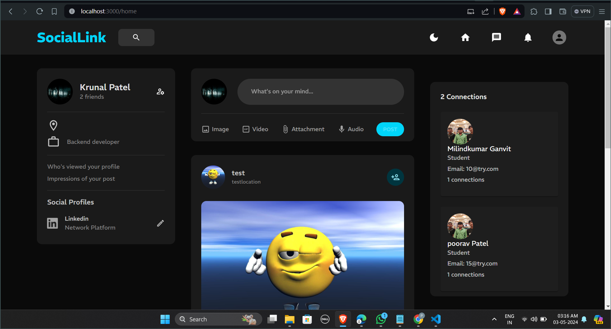
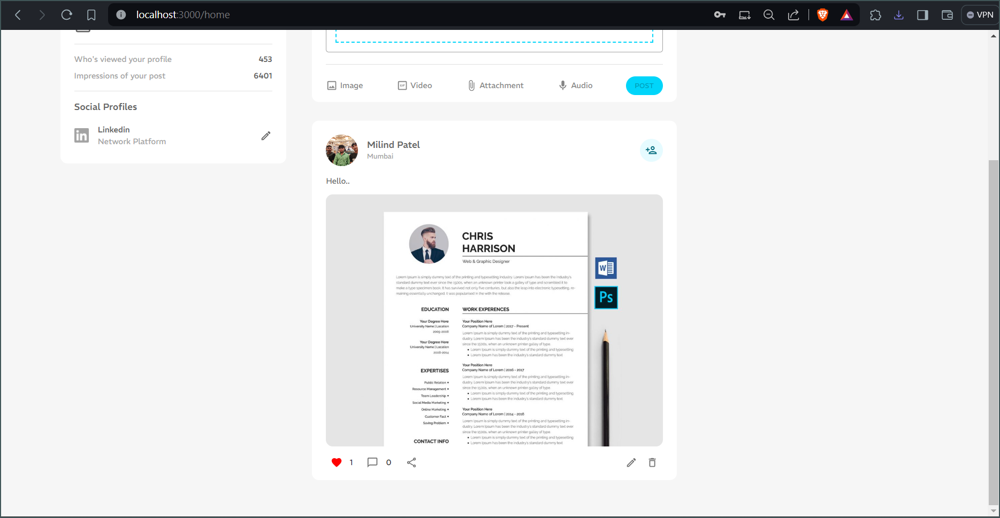
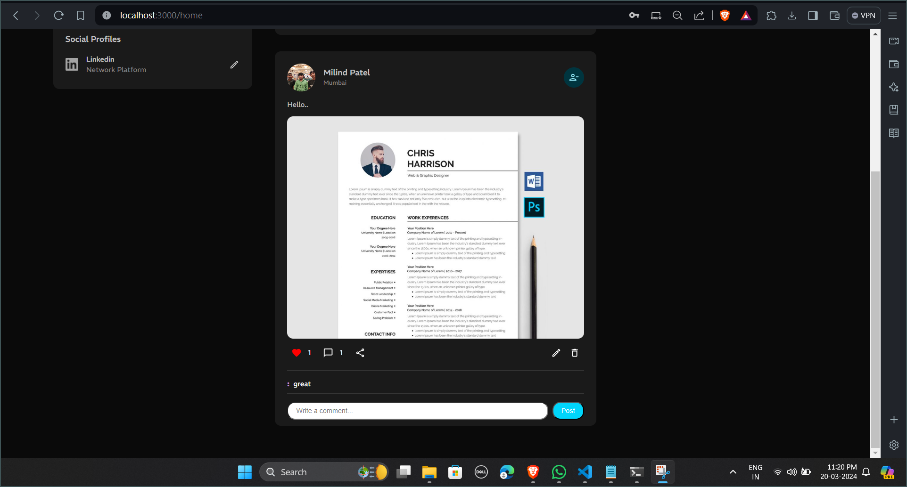
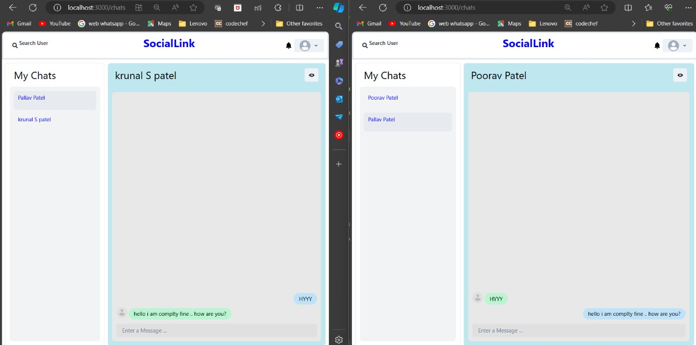
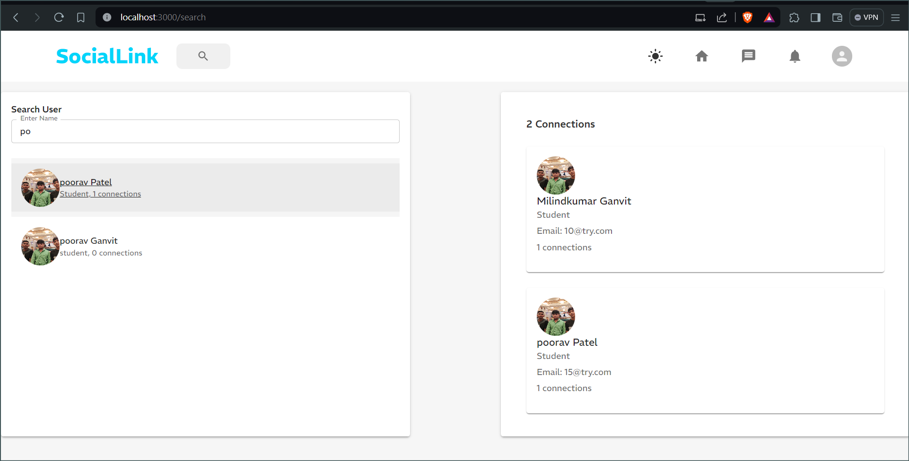
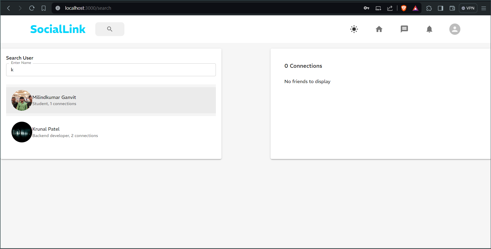
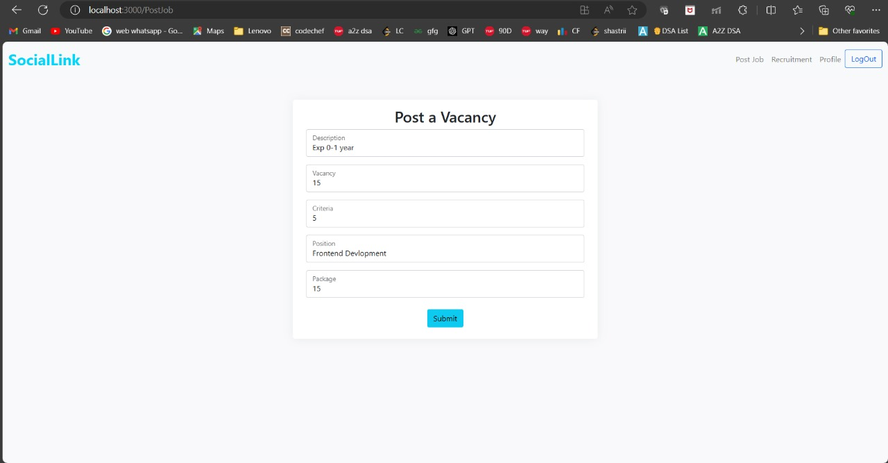
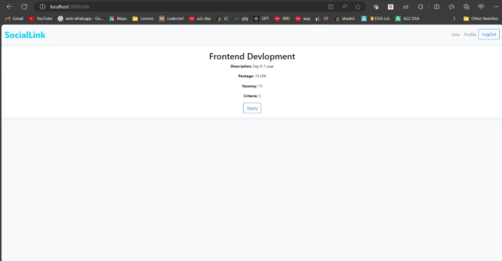
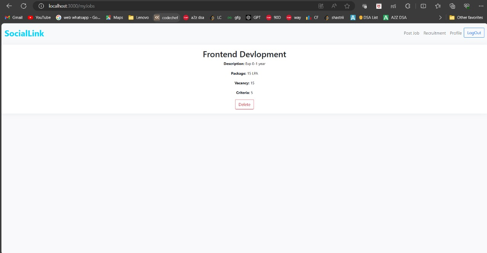
